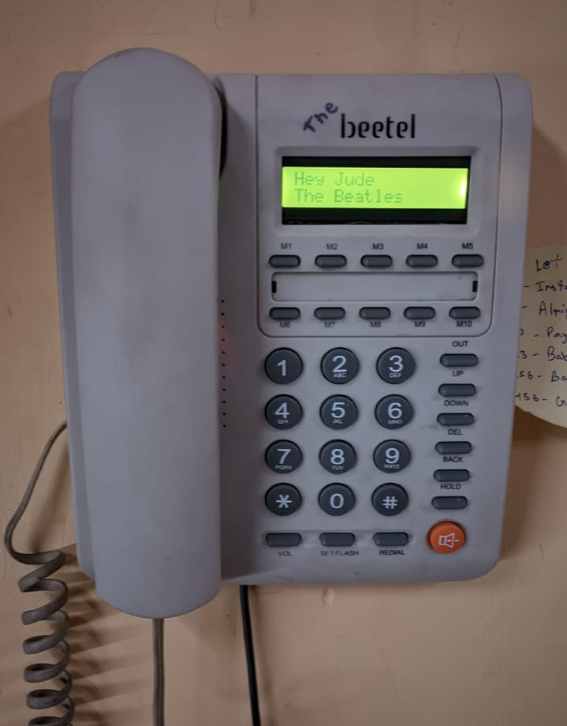
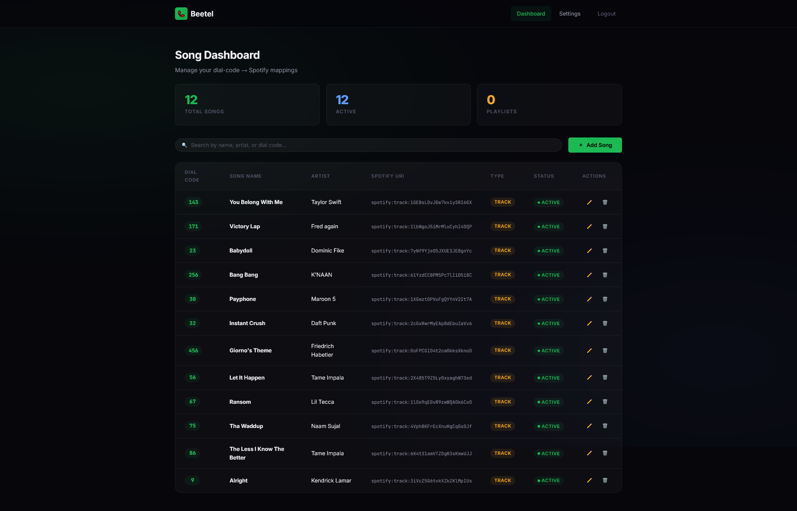
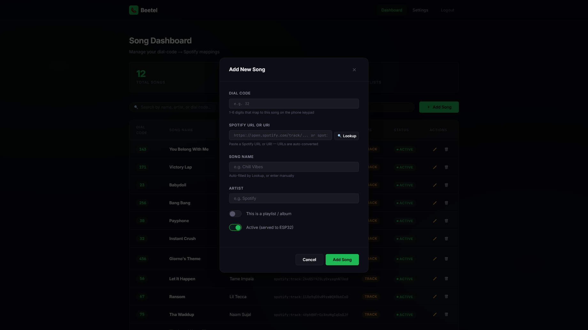

# The Beetel

A dead telephone that now controls Spotify. Dial a number, play a song.

I wired an old Beetel M59 landline to an ESP32 and built a web app to map dial codes to Spotify tracks. Pick up the handset, dial a code, and the music starts playing. No menus, no lag.

## Tech Stack

Hardware:
* ESP32 DevKit
* Matrix keypad (from the original phone)
* 16x2 I2C LCD
* Hook switch (normally-open switch)

Software:
* Firmware: C++ (Arduino framework)
* Backend: Python 3.11, FastAPI, MongoDB (Motor async)
* Auth: API key for hardware, session cookies for the web dashboard

## Architecture & Flow

The system is split into the physical phone and a web backend. 

Inside the phone, the ESP32 reads the original keypad matrix and the hook switch (wired to GPIO 34). It controls the I2C LCD (SDA on 21, SCL on 22).

To eliminate latency, the ESP32 fetches all your song mappings from the FastAPI backend as soon as it boots up and caches them in memory. When you pick up the handset and dial a code, the local cache resolves it to a Spotify URI instantly. The ESP32 then makes a direct call to the Spotify Web API to start playback.

A background loop polls the Spotify API every 3 seconds to keep the LCD updated with the currently playing track name and artist. I reused the physical redial and volume buttons for next, previous, and restart controls.

## Running the Backend

The web app manages the database and provides a web UI to map dial codes to songs.

1. Navigate to the server folder and set up a virtual environment.
2. Install dependencies: pip install -r requirements.txt
3. Copy .env.example to .env. You will need a MongoDB connection string (Atlas free tier is fine), admin login credentials, an API key of your choice for the ESP32, and Spotify Developer App credentials.
4. Run the server: uvicorn app.main:app --reload --port 8000

## Flashing the Hardware

1. Open beetel/beetel.ino in the Arduino IDE.
2. Install the ArduinoJson and LiquidCrystal_I2C libraries.
3. Update the configuration block at the top of the file. You need your WiFi details, the API key matching your .env file, the backend URL, and a Spotify refresh token.
4. Flash it to your ESP32.

To get the Spotify refresh token, use the Authorization Code Flow with your Spotify Developer App. Make sure to request the user-read-currently-playing, user-modify-playback-state, and user-read-playback-state scopes.

## Screenshots

## License

MIT License.
